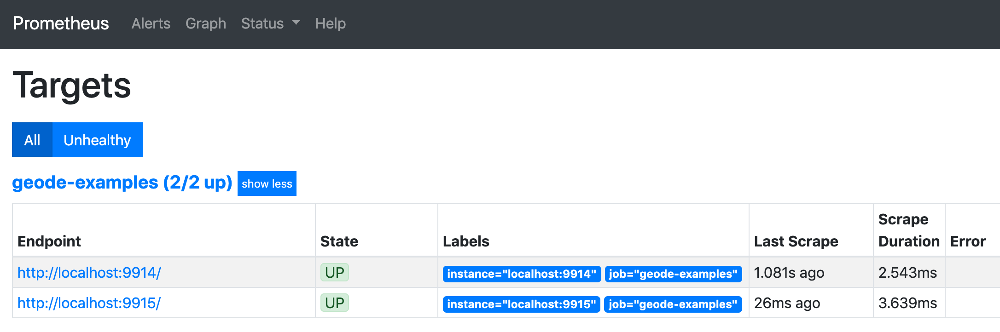
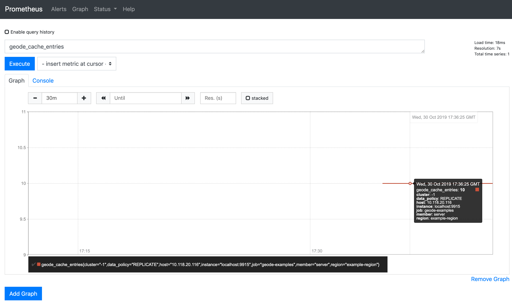

<!--
Licensed to the Apache Software Foundation (ASF) under one or more
contributor license agreements.  See the NOTICE file distributed with
this work for additional information regarding copyright ownership.
The ASF licenses this file to You under the Apache License, Version 2.0
(the "License"); you may not use this file except in compliance with
the License.  You may obtain a copy of the License at

     http://www.apache.org/licenses/LICENSE-2.0

Unless required by applicable law or agreed to in writing, software
distributed under the License is distributed on an "AS IS" BASIS,
WITHOUT WARRANTIES OR CONDITIONS OF ANY KIND, either express or implied.
See the License for the specific language governing permissions and
limitations under the License.
-->

# Geode Micrometer Metrics Example

This example demonstrates publishing metrics from Geode to a monitoring system comprised of
Prometheus and Grafana. For more details about how this works, see [Publishing Geode Metrics to
External Monitoring
Systems](https://cwiki.apache.org/confluence/display/GEODE/Publishing+Geode+Metrics+to+External+Monitoring+Systems).

## Steps to Run and Validate the Example

1. From the `geode-examples/micrometerMetrics` directory, run the `start` task to build the example
   and start a cluster. The cluster will have one locator, one server, and a single region. The
   locator and server will expose HTTP endpoints for Prometheus to scrape.

        $ ../gradlew start

1. Run the example to put entries into the region and verify that the HTTP endpoints are working.

        $ ../gradlew run
        
   The previous command should produce output like the following:
   
        The entry count for region example-region on the server is 10.
        A Prometheus endpoint is running at http://localhost:9914.
        A Prometheus endpoint is running at http://localhost:9915.
     
1. To validate the example, navigate to the endpoints above in a browser. You should see text
   resembling the [Prometheus exposition
   format](https://github.com/prometheus/docs/blob/master/content/docs/instrumenting/exposition_formats.md).
   
## (Optional) Viewing Metrics Using Prometheus and Grafana

1. Download and run Prometheus. Go to <https://prometheus.io/download> to download the
   latest release. Then, run the commands below to extract and run it:
   
        $ tar xvfz prometheus-*.tar.gz
        $ cd prometheus-*
        $ ./prometheus --config.file=../prometheus.yml
        
   The provided `prometheus.yml` file configures Prometheus to scrape Geode's Prometheus endpoints
   at two-second intervals.
        
1. In a browser, navigate to <http://localhost:9090/targets>. This page shows Geode's Prometheus
   endpoints, and their state should be "UP" as shown below:
   
   
   
1. Navigate to
   <http://localhost:9090/graph?g0.range_input=30m&g0.expr=geode_cache_entries&g0.tab=0>. This page
   shows the result of the PromQL query `geode_cache_entries` over the last 30 minutes. It should
   show a value of "10" as the entry count for region `example-region` on the server:
   
   

1. Download and run Grafana. Add a new Prometheus data source with the address of the Prometheus
   server from the previous step. For detailed instructions, see Grafana's [Getting Started
   Guide](https://grafana.com/docs/guides/getting_started/).

1. Once you have added the Prometheus data source, you can import [this
   dashboard](https://grafana.com/grafana/dashboards/11060) from Grafana.com.
   
   To import, select the "plus" icon on the left-hand side and choose the "Import" option. Use the
   ID from the link above for the dashboard and specify the Prometheus data source you created in
   the last step.
   
## Clean Up   
1. Shut down the cluster.

        $ cd ..
        $ ../gradlew stop
        
